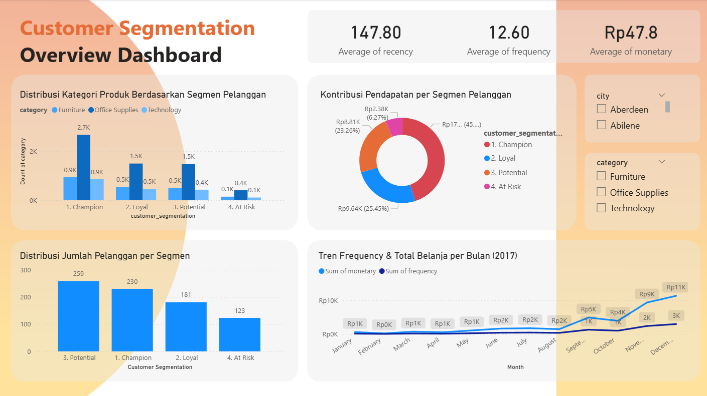

# Customer-Segmentation-Project
🎯 Objective

Membuat segmentasi pelanggan berdasarkan perilaku transaksi untuk mendukung strategi pemasaran yang lebih efektif.
Metode utama yang digunakan adalah RFM (Recency, Frequency, Monetary) karena sederhana, kuat, dan cocok untuk data transaksi Superstore.

# 🗃️ Dataset

- Sumber: Sample Superstore (9.994 baris, data pelanggan & transaksi)

- Fitur relevan:
  - order_date → Recency
  - order_id → Frequency
  - sales → Monetary

- Data quality check:
  - Missing values → tidak ada
  - Duplicate → tidak ada
  - Outlier → dicek, tidak ada yang mengganggu
 

# 🧩 Metodologi

- RFM Calculation
  - Recency: hari sejak transaksi terakhir (sampai 31 Des 2017)
  - Frequency: jumlah transaksi per pelanggan
  - Monetary: total belanja per pelanggan

- Skoring
  - Skor 1–4 untuk masing-masing R, F, dan M
  - Segmentasi akhir berdasarkan kombinasi skor
 

# 📊 Hasil Segmentasi

- Segmen:
  - Champion (230 pelanggan)
  - Loyal (181 pelanggan)
  - Potential (259 pelanggan)
  - At Risk (123 pelanggan)

- Distribusi pelanggan: Segmen Potential mendominasi (259).

- Kontribusi revenue:
  - Champion → 45.02%
  - Loyal → 25.45%
  - Potential → 23.26%
  - At Risk → 6.27%

- Tren bulanan (2017): Peningkatan tajam Agustus–Desember, puncak Desember (Frequency 3.0K, Monetary Rp11.4K).

- Kategori produk: Office Supplies mendominasi di semua segmen

# 💡 Insight & Rekomendasi

- Champion (230)
  - Sangat aktif, nilai transaksi tinggi
  - Program loyalitas eksklusif, personalisasi komunikasi

- Loyal (181)
  - Stabil, rutin membeli
  - Diskon/poin reward, konten khusus untuk retensi

- Potential (259)
  - Pelanggan baru, potensi besar
  - Welcome email + promo first/second purchase, edukasi produk

- At Risk (123)
  - Dulu aktif, sekarang jarang
  - Retargeting campaign “Kami merindukanmu!”, flash sale terbatas
 

# 📊 Visualisasi

Overview Dashboard

Distribusi jumlah pelanggan per segmen

Kontribusi revenue per segmen

Distribusi kategori produk per segmen

Tren frequency & total belanja per bulan

